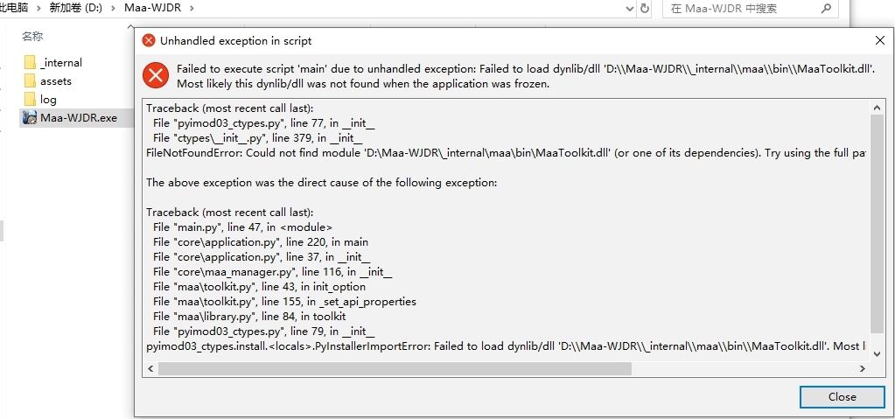

<!-- markdownlint-disable MD033 MD041 -->
<p align="center">
  
</p>

<div align="center" style="font-size: 30px;font-weight: bold;">Maa-WJDR</div>

## 使用环境

<h4>推荐使用<font color=#c00000>MuMu模拟器</font></h4>

修改模拟器分辨率为**手机**分辨率，**720*1280**、**1080*1920**均可。

> 其他模拟器可能存在部分任务无法执行，如：联盟捐献。
>
> 请自行测试。

## 安装与更新

### 安装使用

#### 启动软件

解压下载好的压缩包，运行`Maa-WJDR.exe`即可。

> 建议将解压后的`Maa-WJDR`目录移动至不包含中文字符的目录下，如：`D:\Program Files\Maa-WJDR`。


[<font color=#c00000>！！！启动报错！！！看这里</font>](#启动应用报错)


#### 连接模拟器

运行软件后，仔细阅读公告后，关闭公告弹窗。点击左上角`连接模拟器`按钮，在连接设备弹窗中点击`一键连接设备`按钮。

> 注意：在连接前，请先启动模拟器，启动游戏，并确定进入首页！！！

### 版本更新

更新软件时，删除目录下的`_internal`、`assets`和`Maa-WJDR.exe `文件目录，将压缩包中的对应的三个文件目录复制到目录下，最后运行`Maa-WJDR.exe`。

```text
MAA-WJDR
├─ _internal // 更新时需要替换的目录
├─ assets    // 更新时需要替换的目录
├─ config    // 应用配置文件目录，更新时保留（启动应用后产生）
├─ log       // 日志文件目录（启动应用后产生）
├─ user_data // 用户配置文件目录（启动应用后产生）
│  └─ 888888888.json // 用户ID为888888888的配置文件（连接模拟器成后产生）
└─ Maa-WJDR.exe      // 应用启动程序
```

### 任务配置

**修改任务配置的正确步骤：**

1. **关闭应用**：确保已经连接模拟器并成功识别到用户账号ID后，关闭应用；
2. **修改配置**：在应用所在目录中`user_data`文件夹下，在里找要该配置的账号，用文本编辑器软件（如记事本）打开以账号ID命名的.json文件。**修改后保存文件！**
3. **启动应用**：保存修改后的配置文件，并启动应用。

**true为开，false为关**

```python
# 游荡商人任务是否启用
wanderingMerchantEnable = true
# 游荡商人任务折扣商品列表（可删除内容，删除成对大括号{}即可，如删除整个：{"id": "ExpeditionSkillBook", "name": "史诗远征技能书", "discount_ge_buy": "-25%", }。）
wanderingMerchantDiscountGoodsList = [
    {"id": "ExpeditionSkillBook", "name": "史诗远征技能书", "discount_ge_buy": "-25%", },
    {"id": "CommanderExperience", "name": "统帅经验", "discount_ge_buy": "-25%", }
]

# 灯塔情报任务是否启用
lighthouseIntelligenceEnable = true

# 雪原商路任务是否启用
snowfieldTradeRouteEnable = true
# 雪原商路分享列表（可自由增减）
snowfieldTradeRouteShareList = [
    # 0<=战力<90,000,000并且货物品质>=5的目标会被分享至“低战专用”的群聊
    {"targetName": "低战专用", "powerMinNum": "0", "powerMaxNum": "90,000,000", "goodsQuality": 5},
    {"targetName": "雪原商路", "powerMinNum": "90,000,000", "powerMaxNum": "250,000,000", "goodsQuality": 0},
    {"targetName": "联盟", "powerMinNum": "250,000,000", "powerMaxNum": "350,000,000", "goodsQuality": 0},
]
# 当前用户是否校验货物品质，大于0时进行校验
snowfieldTradeRouteGoodsQuality = 5

# 采集资源任务是否启用
collectResourcesEnable = true
# 采集资源是否启用联盟资源矿
collectResourcesUnionMineEnable = true
# 采集资源设置等级是否启用
collectResourcesSetLevelEnable = true
# 采集资源等级（为空时默认为最大等级采集，若需指定等级，改为对应数字即可，如：[6,7,7,7]）
collectResourcesLevel = [null, null, null, null]
# 联盟总动员任务是否启用（尚未写完的任务，开启无用！！！）
unionMobilizationEnable = false
# 领主指令任务是否启用
lordCommandEnable = true
# 炼晶实验室任务是否启用
crystalRefiningLaboratoryEnable = true
# 仓库体力任务是否启用
warehousePhysicalStrengthEnable = true
# 仓库体力领取时间（提前多久领取，单位分钟，最小值为1）
warehousePhysicalStrengthCollectionTime = 60
# 游历补给任务是否启用
travelSupplyEnable = true
# 角色切换任务是否启用（使用时，建议先开启，然后让应用自动执行角色切换任务，然后根据需要修改“角色切换用户名列表”属性）
roleSwitchEnable = false
# 角色切换间隔，单位分钟
roleSwitchInterval = 60
# 角色切换用户名列表
roleSwitchNameList = null
# 逐光之旅任务是否启用
journeyToTheLightEnable = true
# 训练士兵是否启用（依次为盾矛射）
trainSoldiersEnable = [true, true, true]
# 打开集结是否启用
openAssembleEnable = true
# 竞技场是否启用（尚未完成）
arenaEnable = true
# 竞技场执行时间
arenaExecuteTime = "23:05"
# 竞技场挑战战力倍数（优先挑战低于阈值战力的目标）
arenaChallengeMultiple = 0.85
```

## 常见问题

### 启动应用报错：

若启动应用出现以下报错信息，则为缺少[Visual C++ Redistributable](https://learn.microsoft.com/zh-cn/cpp/windows/latest-supported-vc-redist?view=msvc-170#visual-c-redistributable-v14)运行环境，根据电脑cpu架构选择版本下载安装即可。

fileNotfoundError：`Maa-WJDR\\_internal\\maa\\bin\\MaaToolkit.dll`


### 运行任务时出现乱点情况

请确认模拟器分辨率为**手机**分辨率，**720*1280**、**1080*1920**均可。